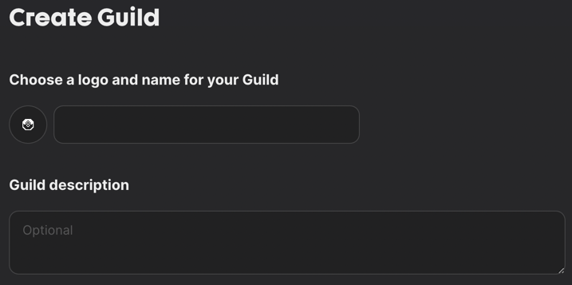
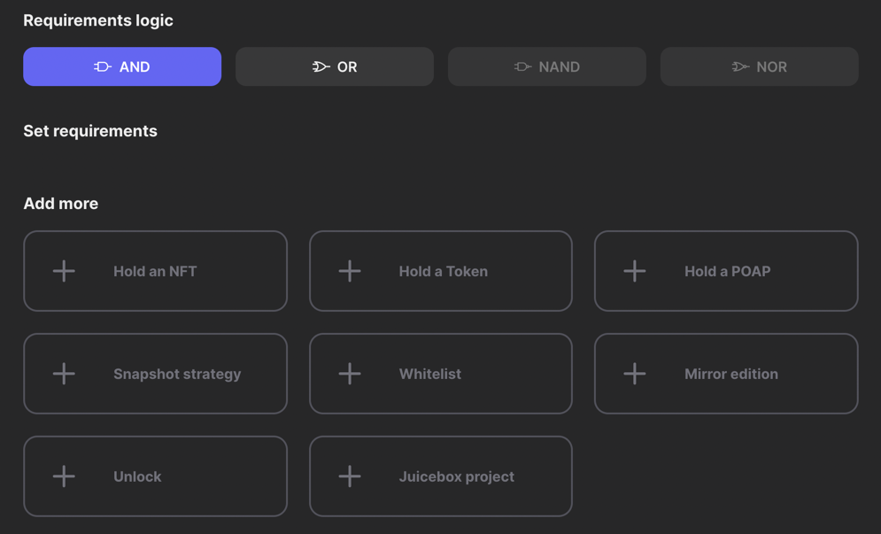
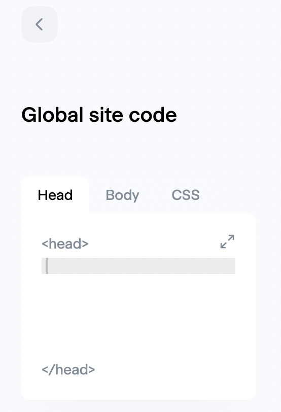

# Web3 site token gate

This is a little project built to make it easy for web3 communities to only allow access to a website if their
wallet content allows them into the community — e.g. holds a certain amount of a token or a certain NFT.

The primary use case was to token gate access to certain [Notion](https://notion.so) pages. Token gating writing to a
notion page is a bigger problem to solve (for another day), but if used in partnership with [Super.so](https://super.so) or
[NotionX](https://github.com/NotionX/react-notion-x) this can be used to only allow community members to view a site made 
from a Notion page.

## Example
A simple little example can be found on cv site [here](https://sean-personal-site.super.site/), only wallets with at
least 0.001 ETH can access it.

### Run locally

## How to set up for Notion

### 1. Create the community on guild.xyz

_For the moment we're going to piggy back off the great work done by [agora.space](https://agora.space)_ to create a community.

1. Go to [alpha.guild.xyz](https://alpha.guild.xyz/)
2. Connect your wallet
3. Set up a guild to create your community 
4. Connect the guild to a discord channel (the discord channel is not required for anything for us, it's just a necessary step for their UI)
5. Set the requirements the allows someone to access the community 
6. SUMMON!
7. Keep the tab open or copy and keep the end of the url which contains the guild e.g.
`https://alpha.guild.xyz/notiontokengate` copy `notiontokengate`

### 2. Create a site from notion

There are at least 2 ways to do this:
1. Create a website from a public Notion page using [super.so](https://super.so)'s paid subsctipion (payment required for injecting code)
2. If you are technical then you can use [NotionX Next.js example](https://github.com/NotionX/react-notion-x/tree/master/example) to create your
   own site from a Notion page and host it on something like [Netlify](https://www.netlify.com/) for free

### 3. Inject the script into the site

### Super.so
1. Once set up on super.so, click on the site -> Code -> `Head`

_You should get to the screen below_



2. Copy the content of the [site injection code](./packages/site-injection-app/site-injection-code.html)
3. Change the `guildUrlName` to match your own (copied above in create the community stage 7)
4. Click back to save
5. TADA!

Now only users who meet the criteria set in the [guild.xyz](https://alpha.guild.xyz) community can access your notion page.


## Development
> This is still in development, and I'm currently working on making sure it's more secure. If you notice anything
> obvious reach out and let me know on twitter at [ssp6sean](https://twitter.com/ssp6sean)

The project is made of 2 parts:
- A simple little app that is injected in to your site
- An api that ensures only those with confirmed access to a wallet

### Run locally
```bash
make install # I haven't set up yarn workspaces yet
# Run the api locally on http://localhost:3000
make api_start
# In a new tab - build the app locally
make app_build
```

You can then, like above, copy the content of [site injection code](./packages/site-injection-app/site-injection-code.html)
(but uncomment the local development line) into a local running site.
